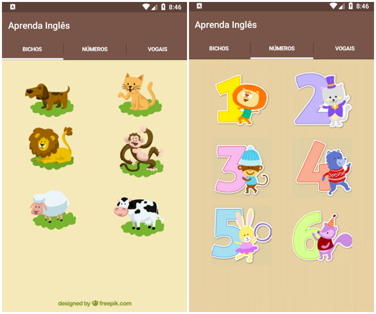

## Aprenda Inglês - Mobile

###  :desktop_computer: Tela

  

----------

### :hammer_and_wrench: Ferramentas
As seguintes tecnologias foram utilizadas na construção do projeto:
- Java;
- XML;
- Android Studio.

----------

###  :gear: Função
- [x] Aplicativo para o ensino da língua inglesa, ao clicar em uma imagem é emitido um som na respectiva língua.

----------

###  :eyeglasses: Autor
José Gustavo da Silva.
[
**Linkedin**
](https://www.linkedin.com/in/jose-gustavo312/)
